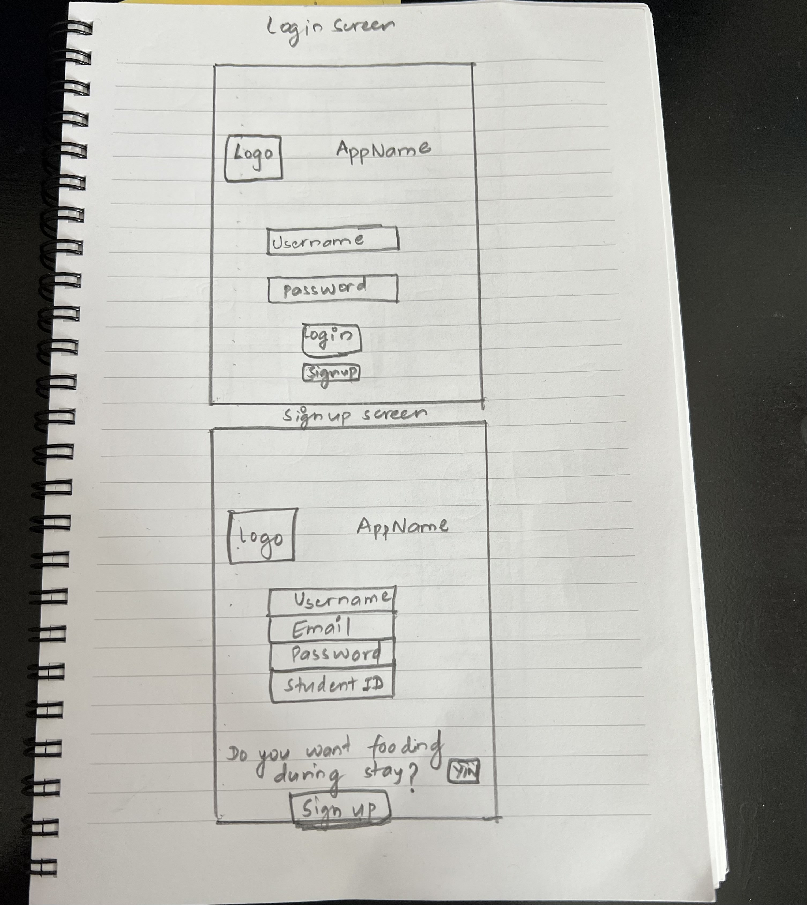
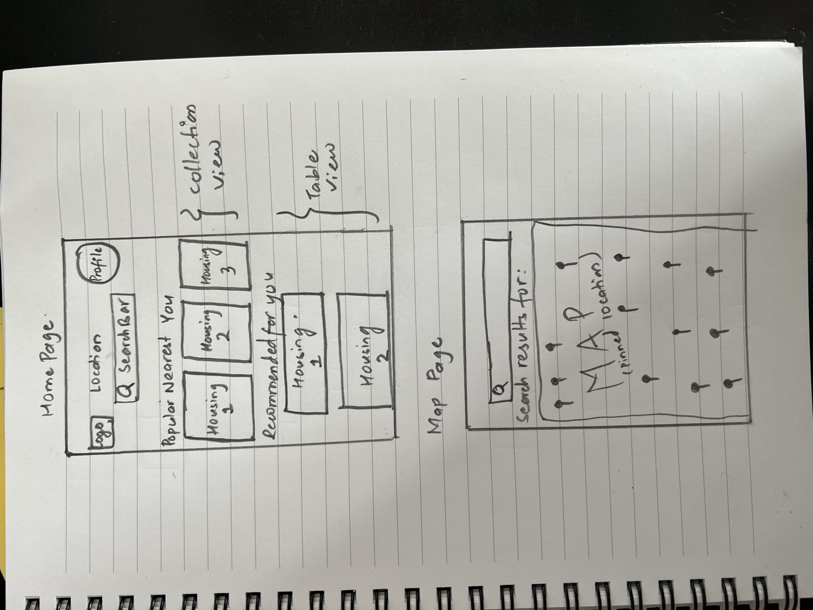
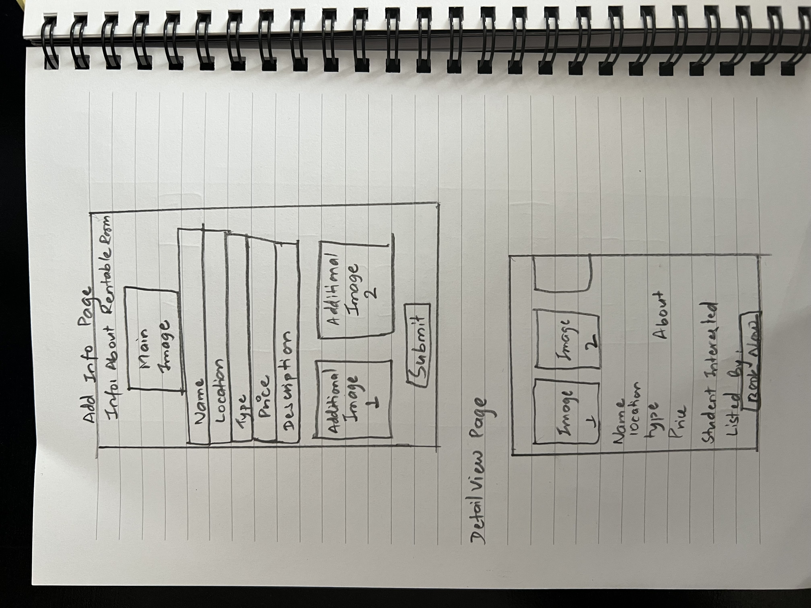

# Students Hive

## Team Members
* Sanjaya Subedi
* Ujjwal Adhikari
* Prem Oli
* Pradeep Lamichhane
* Saharsha Tiwari

## Table of Contents
1. [Overview](#Overview)
1. [Product Spec](#Product-Spec)
1. [Wireframes](#Wireframes)
2. [Schema](#Schema)

## Overview
### Description
Student Hive is a housing app that simplifies the search process for students seeking short-term rental accommodations and food options within their budget during their academic journeys, such as internships or college years. The app offers a variety of rental and sublease choices, flexible lease terms, roommate matching services, food options that cater to students' specific needs and budgets, and a short-term rental posting feature. Student Hive's focus is on the needs of students and aims to provide reliable and high-quality housing solutions that help them thrive and succeed in their academic and professional pursuits.

### App Evaluation

- **Category:** Our app falls under the category of housing to bring mental wellness or self-improvement amongst students.
- **Mobile:** Our app is primarily designed for mobile devices and can be accessed on-the-go, which makes it convenient for users to access whenever they need it.
- **Story:** The app's story revolves around providing housing options for students who are looking for affordable and convenient accommodation near their educational institutions/working spaces.
- **Market:** The app targets the student market, particularly those who are looking for a place to live during their studies/internships/entry-level-roles. The app can also cater to the needs of property owners who want to rent out their properties to students.
- **Habit:** The app is designed to cater to the recurring need of students to find affordable housing whenever they need, making it a habitual app for its target audience.
- **Scope:** The app focuses on providing housing solutions to students, making it a niche app with a focused scope. However, it has the potential to expand its scope by offering additional services such as roommate matching, furniture rentals, and utility management.

## Product Spec

### 1. User Stories (Required and Optional)

**Required Must-have Stories**

* User can signup for the account, login with the existing credentials and sign up for the new credentials.
* User can see the list of available housings based on their current location.
* User can see the pinned locations of housing on map.
* User can view their profile.
* User can post their room information if they want to sublease their room.
* User can see the updated list of housings after they post their room information.

**Optional Nice-to-have Stories**

* User can search housing for any location they want.
* User can tap interested button whenver they find good housing.

### 2. Screen Archetypes

* Login Screen
   * User can login 

* Sign up Screen
   * User can sign up
* Home Page
   * User can view detail page of housing
* Add Information Page
   * User can input their room information for renting it out
* Map Screen
   * User can view the pinned location of housing

### 3. Navigation

**Tab Navigation** (Tab to Screen)

* Home Page
* Map Page
* Add Information of Housing Page

**Flow Navigation** (Screen to Screen)

* Sign Up Page
   * Login Page
* Login Page
   * Home Page
* Home Page
   * Detail View Page
* Add Info Page
   * Home Page
* Map Page
   * None

## Wireframes
Pictures of  hand sketched wireframes

### [BONUS] Digital Wireframes & Mockups

## Schema 
### Models
#### User
| Column | Type | Description |
| ------ | ---- | ----------- |
| objectId | String | Unique identifier for the user (default field) |
| username | String | User's username (default field) |
| password | String | User's password (default field) |
| email | String | User's email address |
| studentID | String | User's student ID |
| name | String | User's  name |
| createdAt | DateTime | Date when the user was created (default field) |
| updatedAt | DateTime | Date when the user was last updated (default field) |

#### Listings
| Column | Type | Description |
| ------ | ---- | ----------- |
| objectId | String | Unique identifier for the listing (default field) |
| Name | String | Nameof the listing |
| About | String | Description of the listing |
| user | Number | user in charge of the listing |
| location | String | Location of the listing |
| images | Array | Array of images associated with the listing |
| createdAt | DateTime | Date when the listing was created (default field) |
| updatedAt | DateTime | Date when the listing was last updated (default field) |

### Networking
#### User Login

User.login(username: username, password: password) { [weak self] result in
            switch result {
            case .success(let user):
                print("✅ Successfully logged in as user: \(user)")
                NotificationCenter.default.post(name: Notification.Name("login"), object: nil)
                let storyBoard : UIStoryboard = UIStoryboard(name: "Main", bundle: nil)
                let nextVC = storyBoard.instantiateViewController(withIdentifier: "UITabBarController") as! UITabBarController
                self?.navigationController?.pushViewController(nextVC, animated: true)
                self?.navigationItem.hidesBackButton = true 
            case .failure(let error):
                self?.showAlert(description: error.localizedDescription)
            }
        }

#### Fetch Listings

private func queryApartments(){
        let query = ApartmentsList.query()
        query.find { [weak self] result in
            switch result {
            case . success(let apartmentsList):
                self?.apartmentsList = apartmentsList
                print(self?.apartmentsList)
                for apartment in self!.apartmentsList{
                    print("aap", apartment)
                }
            case .failure(let error):
                print("Error while loading the data, ",error)
            }
        }
    }

#### Create Listing
let imageFile1 = ParseFile(name: "image.jpg", data: imageData1)
let imageFile2 = ParseFile(name: "image.jpg", data: imageData2)
let imageFile3 = ParseFile(name: "image.jpg", data: imageData3)
let imageFile4 = ParseFile(name: "image.jpg", data: imageData4)
                
guard let aptName = apartmentName.text,
      let aptLocation = apartmentLocation.text,
      let aptType = apartmentType.text,
      let aptPrice = apartmentPrice.text,
      let aptDes = apartmentDescription.text,
      !aptName.isEmpty,
      !aptLocation.isEmpty,
      !aptType.isEmpty,
      !aptPrice.isEmpty,
      !aptDes.isEmpty else{
    return
}

  var post = ApartmentsList()
  post.userUploadPhoto = [imageFile1,imageFile2,imageFile3,imageFile4]
  post.Name = aptName
  post.Location = aptLocation
  post.RoomType = aptType
  post.Rent = aptPrice
  post.About = aptDes
  post.user = User.current?.username
  post.save { [weak self] result in
      DispatchQueue.main.async {
          switch result {
          case .success(let post):
              print("✅ Post Saved! \(post)")
          case .failure(let error):
              print("error", error)
          }
      }
  }

